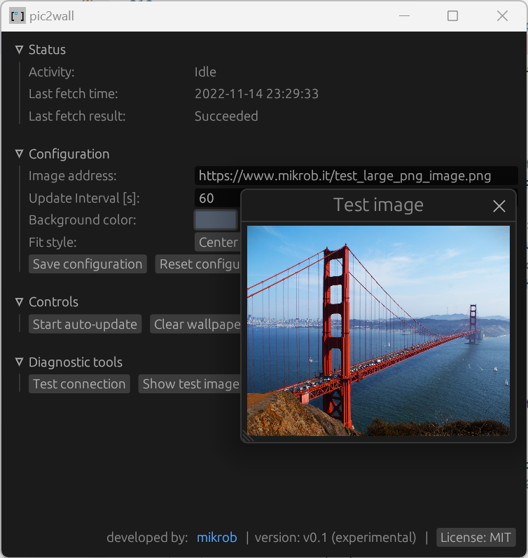
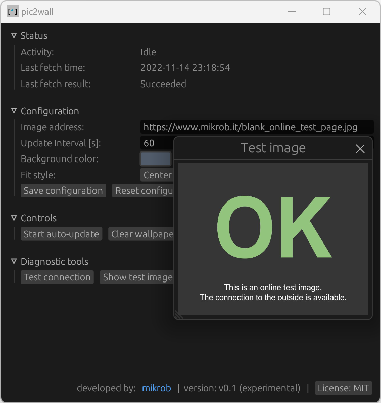
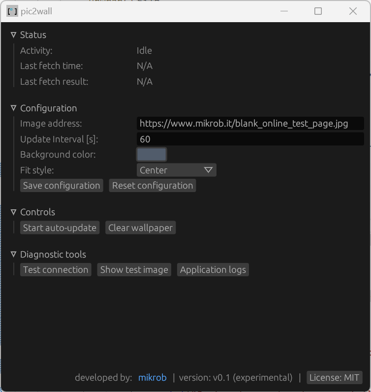
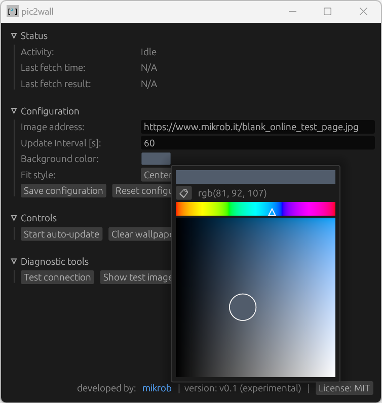

# pic2wall

pic2wall periodically fetches images from the web and applies them as Desktop Wallpaper. With the public webcams being the primary intended source of images, the app is here to brighten up the OS UX allowing observation of ebb and flow in nature, changing lights in cityscapes or anything the depths of the Internet serve you with.

It is widely configurable through a friendly and easy-to-use GUI and provides diagnostic tools to help you out with app setup and troubleshooting should any connection-related issues arise. Multiple image formats are supported as well as persistent configs allowing import and export.

**Build & run instructions**

* Clone & build
* Copy the resources folder and its contents to the folder where the pic2wall.exe resides
* Execute pic2wall.exe, interact with the app through the GUI

**Notes**

* Application logs are stored at log/pic2wall.log or directly accessible from the application's Diagnostic Tools
* Connection to the target image can be tested using the provided Diagnostic tools
* Use update intervals adequate to your image source

**Screenshots**

